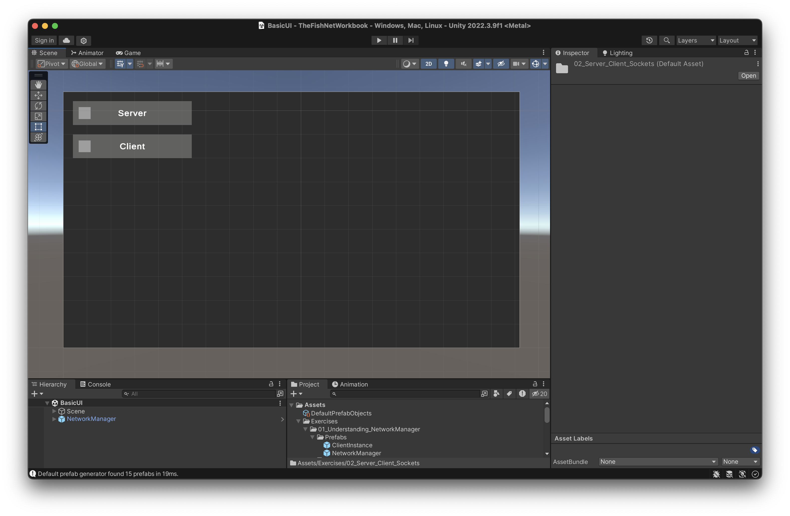
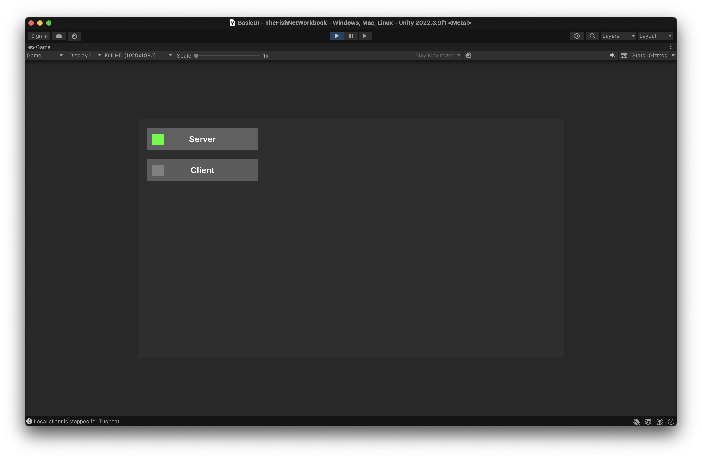

> **Note:** This tutorial is based on the Lobby and Worlds sample project from [FishNet Pro](https://fish-networking.gitbook.io/docs/master/pro-and-donating). I created this set of exercises solely to make it easier for myself (and others) to learn such a powerful library.
>
> If you can, please support the library's developer by subscribing to FishNet Pro [here](https://fish-networking.gitbook.io/docs/master/pro-and-donating).

## Exercises

This is the first section in which we actually get to _work_ with FishNet’s API.

Before you can do any networking, you need to work with FishNet connections.

So, the goal of this section is to teach you (through exercise, not lecture) how to *manage* FishNet connections:

- how to start and stop them,
- how to listen to changes in connection state, and
- how to manage starts and stops through your game’s UI.

You can proceed through the questions below in order to build your understanding. 👇

### Question 1: UI Mockup

Please mock up the following user interface (UI) in Unity:

Note that you will need the following UI elements:

1. **A background**. This can be a simple color.
2. **A "Server" button**, which allows the player to toggle the server connection on or off.
3. **A "Client" button**, which allows the player to toggle the client connection on or off.
4. **A server status indicator** (which is part of the "Server" button), which indicates the status of the server connection.
5. **A client status indicator** (which is part of the "Client" button), which indicates the status of the client connection.

You don't need to follow the mockup in a pixel-perfect fashion, but you _should_ ensure that the elements listed above are present.

Answer

In the `BasicUI.unity` scene, please see the `NetworkCanvas` GameObject under the `NetworkManager` for an example of how to construct this mockup in Unity's UI system.

Note that all components are built into Unity. You do not need to bring in additional assets or libraries, nor do you need to create new scripts for the sake of this question.

However, remember to create an `EventSystem` GameObject! Otherwise, your button presses won't work.

### Question 2: Managing server connections

FishNet's API provides the ability to start and stop server connections:

- [`NetworkManager.ServerManager.StartConnection()`](https://firstgeargames.com/FishNet/api/api/FishNet.Managing.Server.ServerManager.html#FishNet_Managing_Server_ServerManager_StartConnection)
- [`NetworkManager.ServerManager.StopConnection()`](https://firstgeargames.com/FishNet/api/api/FishNet.Managing.Server.ServerManager.html#FishNet_Managing_Server_ServerManager_StopConnection_System_Boolean_)

For this question, create a script that contains a handler for your "Server" button.

Within this handler, you should invoke `StartConnection()` (see above) if the server is stopped, and `StopConnection()` otherwise.

Note that you will need to fetch the server state. To do this, you can listen to [`NetworkManager.ServerManager.OnServerConnectionState`](https://firstgeargames.com/FishNet/api/api/FishNet.Managing.Server.ServerManager.html#FishNet_Managing_Server_ServerManager_OnServerConnectionState), and save the state to a variable.

Answer

See the `NetworkCanvas` GameObject within the `BasicUI.unity` scene for an example of how this works.

Within the `NetworkCanvas.cs` script attached to the `NetworkCanvas` GameObject, the method is named `HandleClickServer()`.

Note that after implementing the answer to this question, you should now be able to start and stop a server connection by pressing the "Server" button — although you will not see any visual feedback just yet.

### Question 3: Managing client connections

Like in [Question 2](#question-2-managing-server-connections), implement the same toggling behavior, but for client connections through the "Client" button toggle.

Note that [`StartConnection()`](https://firstgeargames.com/FishNet/api/api/FishNet.Managing.Client.ClientManager.html#FishNet_Managing_Client_ClientManager_StartConnection) and [`StopConnection()`](https://firstgeargames.com/FishNet/api/api/FishNet.Managing.Client.ClientManager.html#FishNet_Managing_Client_ClientManager_StopConnection_System_Boolean_) will live on `NetworkManager.ClientManager`, not `NetworkManager.ServerManager`.

Note that you will need to fetch the client state this time (not server state). To do this, you can listen to [`NetworkManager.ClientManager.OnClientConnectionState`](https://firstgeargames.com/FishNet/api/api/FishNet.Managing.Client.ClientManager.html#FishNet_Managing_Client_ClientManager_OnClientConnectionState), and save the state to a variable.

Answer

See the `NetworkCanvas` GameObject within the `BasicUI.unity` scene for an example of how this works.

Similar to the server handling, the method is named `HandleClickClient()`.

Note that after implementing the answer to this question, you should now be able to start and stop a _client_ connection by pressing the "Client" button — although you will not see any visual feedback just yet.

### Question 4: Status indicators

Now that our buttons have properly implemented handlers, we should display *visual feedback* so that a player understands that connections are starting and stopping — without having to peer at the source code.

To do so, please define 3 colors as serialized fields for our status indicators:

1. a "stopped connection" color,
2. a "pending connection" color,
3. and a "started connection" color

Additionally, define an `UpdateColor()` method so that our status indicators are updated to the colors you've defined, based on the current client connection state and server connection state.

Answer

Please see the `UpdateColor()` method in this repo's included `NetworkCanvas.cs`. Note that default colors are defined within `NetworkCanvas.cs`, which you can use as an example.

### Question 5: Responding to connection state changes

Now that we've defined the `UpdateColor()` function for our server and client status indicators, we should invoke the `UpdateColor()` method when the connection states change, so that the status indicators reflect the current connection states.

Remember: `OnConnectionStateChange` is an event on `NetworkManager.ClientManager` as well as on `NetworkManager.ServerManager`.

Update your implementation so that you invoke `UpdateColor()` in response to the events above.

Additionally, remember to update your colors initially as well. (In `Start()`.)

Answer

See `NetworkCanvas.cs` once again for examples of when `UpdateColor()` is invoked.

If you are unfamiliar, note how we subscribe and unsubscribe from `OnConnectionStateChange` events. In this case, unsubscription occurs in `OnDestroy` (upon GameObject destruction), so it is more robust than if we were to unsubscribe within `OnDisable`, which may be unintended if we accidentally disable the GameObject.

### Question 6: Automatic connections

Implement a notion of an *automatic connection*, so that client or server connections are started automatically when the game is started.

You should have 4 configuration options:

- no automatic connection
- automatically start client connection
- automatically start server connection
- automatically start client and server connection (so the game acts as both client and server)

### Answer 6

Please see the `AutomaticConnection` enum within `NetworkCanvas.cs` for an example of how this is done.

In the example implementation, connections are made by calling our button handler functions (which start or stop connections) within the `Start()` method.

Make particular note of the `Application.isBatchMode` check, which checks whether the game is running in command-line mode. This occurs when the game runs as a headless server, such as in a dedicated server scenario.

### Conclusion

If you've successfully worked through the questions above, you can now:

- toggle server and client connections in your minimal Unity app, and
- have the UI display visual feedback in a consistently color-coded way.

