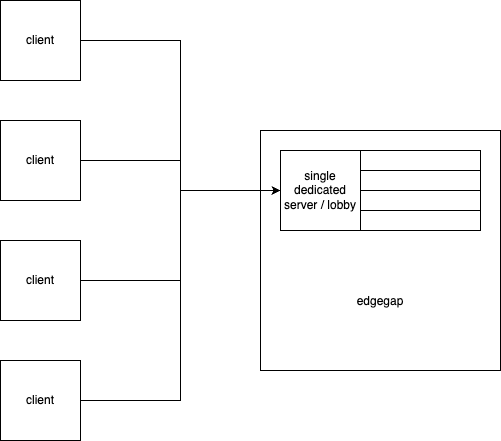

> **Note:** For many of the questions below, further nuanced answers can be gleaned by asking [ChatGPT](https://chat.openai.com/) follow-up questions.

## Exercises

In this section, we take a step back and consider the big picture: the high-level architecture of a multiplayer game.

Multiplayer games consist of several components, namely:

* network topology
* transport
* runtime
* hosting
* services

And understanding each component conceptually will help you make decisions when choosing between different options.

Thus, you can proceed through the questions below in order to build your conceptual understanding. 👇

### Question 1: Network topologies

List the 5 (usual) types of network topologies for a multiplayer game, and list some pros and cons of each.

Answer

| Network topology       | Pros                                                                                                                                                                                                                                               | Cons                                                                                                                                                                                                                                                                                                                                                                                       |
|------------------------|----------------------------------------------------------------------------------------------------------------------------------------------------------------------------------------------------------------------------------------------------|--------------------------------------------------------------------------------------------------------------------------------------------------------------------------------------------------------------------------------------------------------------------------------------------------------------------------------------------------------------------------------------------|
| Couch or split-screen  | Single device; does not require any networking.                                                                                                                                                                                                    | Cannot be played beyond a single device. Limited scale and reach.                                                                                                                                                                                                                                                                                                                          |
| LAN                    | Enables far more players to play together in the same game, because they don't have to share the same screen.  Cheap, because it doesn't require server hosting.                                                                         | Limited reach; play is limited to players on the same network.                                                                                                                                                                                                                                                                                                                             |
| Peer-to-peer           | Players can play games while located anywhere, without being geographically bound to the same location or network.                                                                                                                                 | LHigh network complexity because each device must synchronize with every other device. Not very scalable for that reason.  Security concerns because there is no centralized server validating network requests.                                                                                                                                                                 |
| Client-hosted server   | Players can play games while located anywhere, without being geographically bound to the same location or network.  Cheap, because no dedicated server hosting is required. Players host their own servers.                              | Poor latency, because players must relay data through "relay servers" in order to get around firewalls or Network Address Translation (NAT) limitations.  Host migration is an issue; if the host decides to leave the game, selecting another host can lead to a poor user experience.  Host advantage, in which the player hosting the game has a latency advantage. |
| Dedicated server       | Players can play games while located anywhere, without being geographically bound to the same location or network.  Secure, because the centralized server can act as a single point of validation (authority) for all network requests. | Cost. It may be expensive to run a dedicated server in the cloud (or otherwise), especially as the number of concurrent users (CCU) scales up.                                                                                                                                                                                                                                             |

### Question 2: Peer-to-peer network stack

In a peer-to-peer network topology, devices must communicate with each other directly. This poses problems, because firewalls or other network configuration interferes with this ability. 

How would we typically work around such network issues? Give an example of a modern solution that has been deployed.

Answer

We need a **relay server**: an intermediate server or middleman that facilitates communication when peers cannot establish direct connections with each other. This enables players to send and receive data, and work around such obstacles as firewalls or Network Address Translation (NAT) issues. An example of a relay server in the wild would be [Unity's Relay service](https://unity.com/products/relay).

### Question 3: Game examples

What are examples of games with a *client-hosted server* topology, where there is no centralized server, and a player can simultaneously serve as a server and a client?

As an addon to the question, what are examples of games with a dedicated server topology, where game hosting can be handled purely by the development team?

Answer

Some examples of client-hosted server games include Minecraft, Rocket League, Among Us, and Sea of Thieves.

Some examples of dedicated server games include Fortnite, Roblox, Valorant, Overwatch, and League of Legends.

There are many others, and if you are unfamiliar with the games above, it helps to find a game you've played that falls under each topology to grasp the concepts.

### Question 4: TCP versus UDP

What is TCP, and what is UDP? List 3 key differences between the two.

Answer

TCP and UDP are network protocols that sit at the Transport layer of the network stack.

TCP stands for Transmission Control Protocol, which prioritizes reliable (data is never lost), ordered delivery of data packets.

On the other hand, UDP stands for User Datagram Protocol, which prioritizes low latency while accepting some data loss.

Some key differences you may have listed:

| TCP                                                                                                                                         | UDP                                                                                                             |
|---------------------------------------------------------------------------------------------------------------------------------------------|-----------------------------------------------------------------------------------------------------------------|
| **Connection-oriented.** A connection between client and server must be established before data is sent.                                    | **Connectionless.** A connection between client and server is not required to send data.                        |
| **Reliable.** TCP ensures delivery of data through acknowledgement (ACK) and retransmission mechanisms.                                     | **Unreliable.** Does not guarantee delivery of data.                                                            |
| **In-order delivery.** Packets arrive in the order that they were sent.                                                                     | **Not necessarily in-order.** Packets do not necessarily arrive in the order that they were sent.               |
| **More overhead.** Establishing connections and error checking requires more processing overhead, which makes TCP somewhat less performant. | **More performant.** Does not perform error checking in the same way as TCP, and thus requires less processing. |

### Question 5: REST versus RPC

What is REST, and what is RPC? List 3 key differences between the two.

Answer

REST and RPC are not directly comparable, since they define concepts instead of a particular protocol.

REST is an architectural style that defines design principles for building networked applications.  While RPC refers to Remote Procedure Call: the idea that you can call a procedure within one process, which in turn is handled within another process (or computing device).

Some key points about REST:

1. **Client-server architecture.** Clients make network requests to servers, and servers process requests and provide network responses.
2. **Stateless.** The server doesn't store client state between requests, enabling scalability.
3. **Uniform interface.** REST defines resource URIs for your application's data resources, and exposes access to those resources using standard verbs, such as HTTP methods. Clients and servers transmit representations of resources through standard data formats, such as JSON or XML.

And some key points about RPC:

1. **Remote communication.** RPC refers to the idea that a program can cause a procedure to execute within another address space (or machine), but invoke that execution as if it were a local procedure call.
2. **Parameter passing.** You can pass additional data through parameters.
3. **Implementation.** There are different implementations of the RPC idea: XML-RPC, CORBA, and gRPC (which uses HTTP/2 for transport and protobufs for serialization).

To compare the two:

1. It's not an apples-to-apples comparison. REST can be implemented atop RPC.
2. In REST, you make 1 request, and get 1 response. In RPC, you make 1 request, and potentially get many responses.
3. RPC focuses on doing 1 thing per endpoint (such as `GetAllUsers`). While REST defines operations in terms of resources, such as `GET /users`.

### Question 6: FishNet's transport

FishNet abstracts the sending and receiving of data into `Transport` objects. What protocol does FishNet's default [`Transport`](https://fish-networking.gitbook.io/docs/) use under the hood: TCP, or UDP?

Answer

FishNet's default `Transport` class is [Tugboat](https://fish-networking.gitbook.io/docs/manual/components/transports/tugboat), which uses the library [LiteNetLib](https://github.com/RevenantX/LiteNetLib).

LiteNetLib bills itself as a "lite reliable UDP library" (thus, your answer). While UDP is typically known to be an unreliable protocol, it seems this library also handles some reliability features that you typically see in TCP.

### Question 7: Server executables

FishNet facilitates a workflow in which you author server and client code in the same project.

However, one typically imagines servers as standalone applications written in a server-side language, such as C# or JavaScript or otherwise. It isn't immediately obvious how you'd produce a server executable from a FishNet project.

How does one build a server executable from a FishNet project?

Answer

If you haven't done too much multiplayer work, keep in mind that Unity can be built to its [Dedicated Server platform](https://docs.unity3d.com/Manual/dedicated-server.html), which will produce a standalone server executable with no graphical output.

### Question 8: Unity servers versus standalone servers

Compare FishNet (and its workflow that houses client and server code in the same project) to writing your own game server in a separate project. List 3 pros and cons.

Answer

FishNet is tightly integrated with Unity's GameObject workflow through `NetworkBehavior`, and it's very good at doing one thing (game networking) well.

It may not be a good fit if you'd like your game server to be compatible with non-Unity game clients. It may also not be a good fit if you have a server team that would prefer to *not* use Unity.

Additionally, it may not be a good fit if you require more flexible access to databases or online services outside of the context of Unity. (That is, you don't require programmatic access to the Unity Editor nor the game client.)

### Question 9: Online services

List 5 online services that you might need in a multiplayer game, and also list their corresponding functions.

*Hint: It may help to review some of Unity's [Gaming Services](https://unity.com/solutions/gaming-services) offerings.*

Answer

Some answers you may have come up with:

| Service      | Purpose                                                                                                        |
|--------------|----------------------------------------------------------------------------------------------------------------|
| Auth         | Identify who the user is throughout repeated play sessions.                                                    |
| Matchmaking  | Match players depending on criteria so that a round of play can be started.                                    |
| Leaderboards | Rank players on a global or local leaderboard.                                                                 |
| Friend list  | Allow players to see friends’ statuses in-game.                                                                |
| Text chat    | Allow players to chat (through text) with each other.                                                          |
| Voice chat   | Allow players to chat (through voice) with each other.                                                         |
| Analytics    | Instrument your code with events so that you can analyze event data afterward for player or business insights. |

### Question 10: Lobby and Worlds

The [Lobby and Worlds](https://fish-networking.gitbook.io/docs/master/pro-and-donating#projects) example project included with FishNet serves a particular purpose within the context of a multiplayer game's architecture.

What is that purpose? How does that compare to alternative solutions that accomplish the same purpose?

*Hint: See the answer to [Question 9: Online services](#question-9-online-services) for examples of components of multiplayer game architecture.*

Answer

[Lobby and Worlds](https://fish-networking.gitbook.io/docs/master/pro-and-donating#projects) performs (essentially) manual matchmaking, in which players create and join rooms, and mark themselves as ready in order to proceed to live gameplay.

Thus, unlike other matchmaking solutions, there is no matchmaking algorithm or criteria.

### Question 11: Architecture

For the rest of this project, we will be re-creating a lobby system similar to the [Lobby and Worlds](https://fish-networking.gitbook.io/docs/master/pro-and-donating#projects) project from FishNet.

Clients are able to connect to a single, dedicated game server, which will serve as a pre-game lobby. Additionally, instances of the game will run on the same server.

Please use a diagramming tool such as [draw.io](https://app.diagrams.net/) (free) or [LucidChart](https://lucidchart.com/) (freemium), and draw a diagram of this multiplayer game architecture.

Answer

Any multiplayer game is a complex distributed system, and it is an excellent practice to develop the habit of drawing architecture diagrams to visualize the complex interactions.

The following is a simple diagram that illustrates our single server. Note that a stack of rectangles denotes the rooms and game instances that are created:

### Congrats! 🎉

Pat yourself on the back! You should now have a firm, big-picture-view of why you would want to read this workbook.

The rest of this workbook focuses specifically on the FishNet API mechanics that underlie the construction of a game lobby system.

You can use this guide as a learning aid to simultaneously learn FishNet's API, and use the final lobby system as a building block for any multiplayer game of your choosing.
