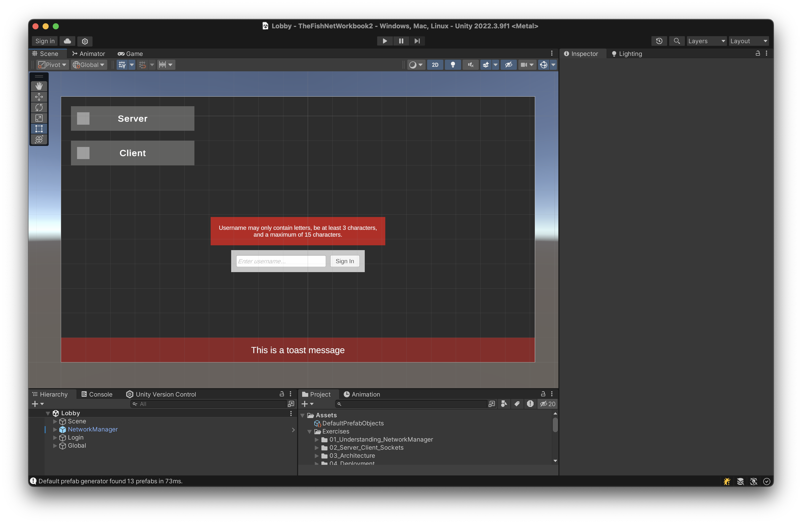
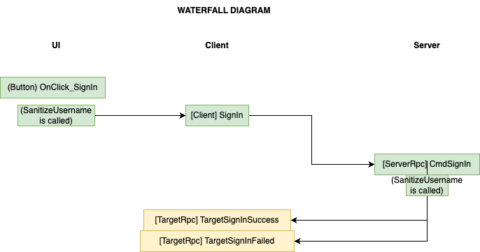
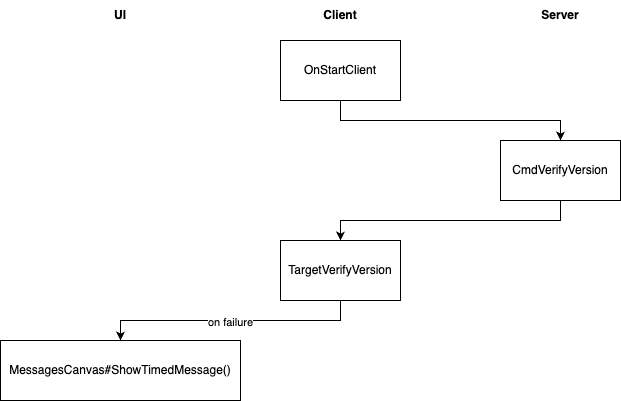

> For this set of exercises, the goal is to implement the notion of logging in users in your FishNet application.
>
> Additionally, the secondary goal is to start grasping the data flow of a FishNet application's hooks, as well as to start reviewing your work through QA user stories.

## Exercises

### Question 1: Login Screen Mockup

Building atop the `.scene` file from previous exercises, mock up a simple login screen in your scene's Unity hierarchy.

Ensure that your UI/UX design can accomodate the following user stories, or use cases:

1. User can type in their desired username in an input field.
2. User can press enter to submit their desired username.
3. User can see visual feedback for failed validation on their desired username.
4. User can see visual feedback for success validation on their desired username.

For reference, here is the design from my own sample scene, which is provided:

Answer

Please see the scene file within this `05_Auth/` directory, which provides a sample implementation that satisfies the user stories in this question.

### Question 2: DDOL

What does DDOL stand for?

How is our NetworkManager prefab configured such that DDOL is applied? And why do we need DDOL to begin with?

Answer

DDOL stands for Don't Destroy On Load. It refers to the Unity method [`Object.DontDestroyOnLoad`](https://docs.unity3d.com/ScriptReference/Object.DontDestroyOnLoad.html).

To configure DDOL on our NetworkManager component, all that is needed is to configure the [`Dont Destroy On Load`](https://fish-networking.gitbook.io/docs/manual/components/managers/network-manager) checkbox in the Unity inspector.

DDOL is required in the case where we load new scenes, such as when we place a `Lobby` scene with a `Game` scene.

We do not want to destroy the current instance of our `NetworkManager` prefab/GameObject when doing so, since the GameObject contains our entire FishNet networking configuration. 😅

### Question 3: Login Feature

We now move onto actual networked feature implementation with FishNet.

With the mockup that you created in [Question 1](#question-1-login-screen-mockup), the data flow for such a feature might resemble the following:

Note the flow of data between Unity UI method handlers, and methods tagged with `[Client]`, `[ServerRpc]`, and `[TargetRpc]`.

For this question, implement the dataflow described in the image above.

Answer

Please see the attached files within this `05_Auth/` directory for an example implementation.

Note that we reuse classes that already exist in the application. In this case, much of the login implementation resides in `LobbyNetwork.cs`.

Also note that — yes — both client and server methods live in the same C# class, and the client and server will take different code paths within the same class.

### Question 4: Version Check Feature

Now that we've run through the workflow of implementing a single FishNet feature, let's implement a second feature.

We'd like to implement a **version check**, such that if a client connects to a server with a different version of our game client, the client will be disconnected.

The user stories (or use cases) would be as follows:

1. User is disconnected if game client version does not match game server version.
2. When disconnected, user will see a timed popup message mentioning that the client-server versions do not match.
3. If client-server versions *do* match, user is *not* disconnected and instead will see a timed popup message stating that connection was successful.

Like the login feature, diagram out the dataflow in [Draw.io](draw.io) first, then implement the code behind the dataflow.

Answer

You should have ended up with something similar to this dataflow:

Note that UI feedback is only shown on *failed* version check. In other words, if the version check succeeds,
the user should simply proceed without impeding their process.

For code implementation, please see `ClientInstance.cs` in the code within the `05_Auth/` directory for reference.

### Question 5: Development Pipeline

Having now developed 2 networked features from scratch, draw out your workflow or *pipeline* for implementing a networked feature from start to finishprocess or *workflow* for implementing a networked feature from start to finish.

Game development consists of many "pipelines" in the process of transforming an idea into reality, and you should codify yours so that you can optimize your pipeline over time. (With a sufficiently fast pipeline, you could try entering multiplayer game jams and crank out an amazing game in a weekend!)

Answer

In the previous 2 questions, we roughly followed this pipeline:

1. **Requirements.** Describe the user story.
1. **Frontend design.** Mock up a UI/UX design.
1. **Backend design.** Sketch out the dataflow in Draw.io or Lucidchart (or your diagramming tool of choice).
1. **First draft.** Implement a first draft at the code implementation, starting with UI or underlying implementation based on personal preference.
1. **ParrelSync.** Test with ParrelSync to ensure that your draft works.
1. **Final draft.** Clean up the code, reviewing the changed files through GitHub pull requests in highlighting parts that may need to be revised.
1. **Build.** Build an executable, and test in those executables to QA + sign off on your original user story.

In particular, note the QA steps that are described in the latter stages of the pipeline. You should define how you verify the quality of features that you build, since it's critical to developing quickly on a multiplayer project.

### Question 6: RPC Acknowledgement

With all the newly implemented RPC calls as part of [Question 4](#question-4-version-check-feature) and [Question 5](#question-5-development-pipeline), we have to ask: are RPC calls synchronous or asynchronous in FishNet?

That is, when an RPC call is fired, does the sender of the call wait for the RPC call to be received before continuing execution?

Answer

The sender of an RPC call **does not** wait for the RPC call to be received before continuing.

A sender would send the RPC, then immediately continue. In order to receive an acknowledgement from the object of the RPC call, we would need to define a *separate* RPC call from the object (now the sender) back to the original sender (now the object).

Then, we'd need to wait for this separate RPC call to be received on the original sender before we can acknowledge that the first (original) RPC call was sent and received.

